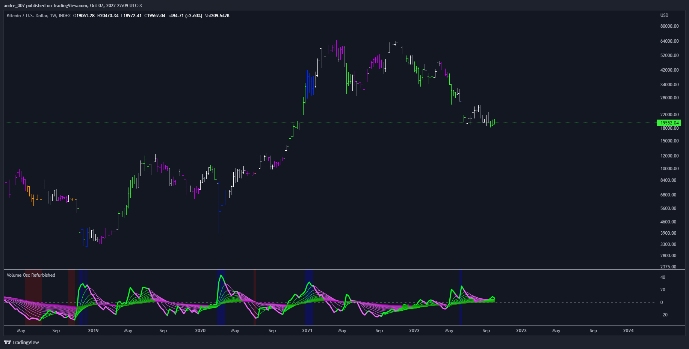

# █ DMI Stochastic Extreme Refurbished

This is an experimental version of Volume Oscillator.

For more information about Volume Oscillator, please access the link below:

https://www.tradingview.com/chart/yuvefwOP/?solution=43000591350

## Objective

The script presented here provides some improvements over the original indicator, namely:

- Show multiple moving averages;
- Color the bars according to the direction of the averages;
- Color the bars when reaching predefined limits.

## █ THANKS AND CREDITS

- Volume Oscillator: TradingView
- Moving Averages: PineCoders, CrackingCryptocurrency, MightyZinger, Alex Orekhov (everget), alexgrover, paragjyoti2012, Franklin Moormann (cheatcountry)

## █ DONATIONS

- BTC: 1PnerhP2C5xeGXxAkhxQX4rYrBUguGe1yh
- LTC: LMhAfkzJoUHHWfFCcMnnQ4jdV4Vi9WZG3W
- Stellar: GCPONJ5OX7KSEHBNPB2SKJZJGYSXTRN7ORYQXW443BLEFLS72ZVYISG2
- Zcash: t1THe8JvsYqt7bmbFWkFpjssJhJLka6VAhk
- Tron: TSVnEgtoYhRMwiRYfDFC51XfGNSpxse2yz
